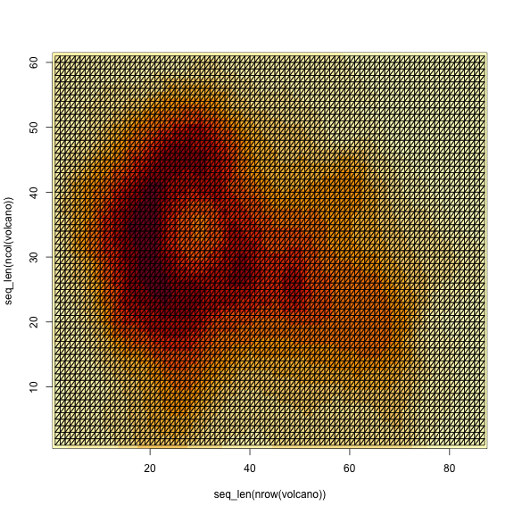
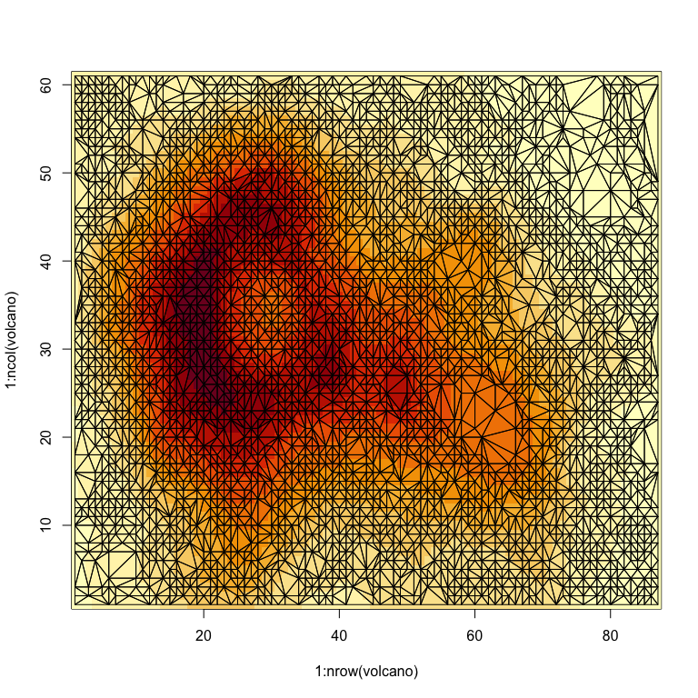
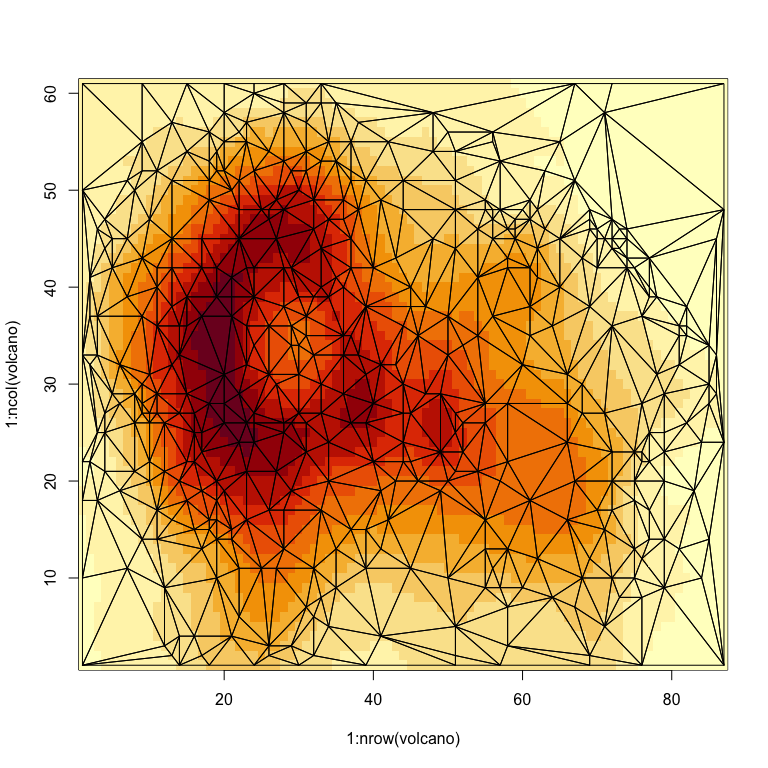
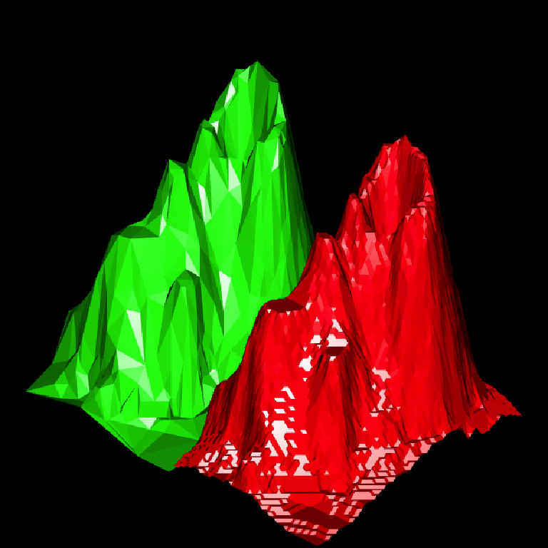
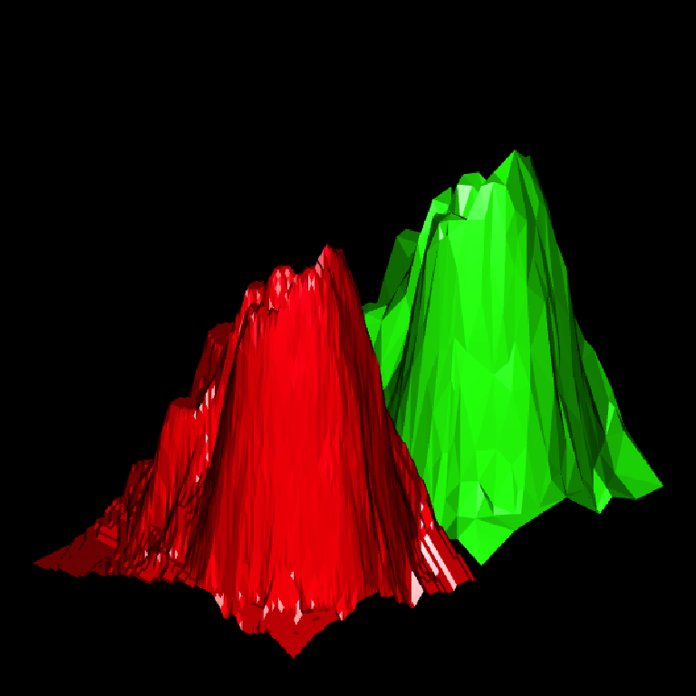
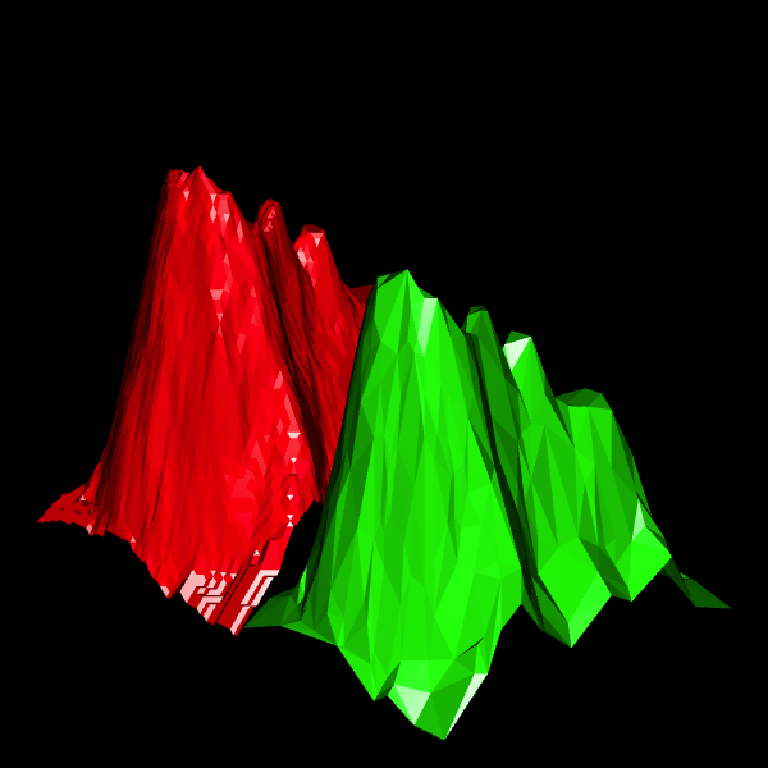
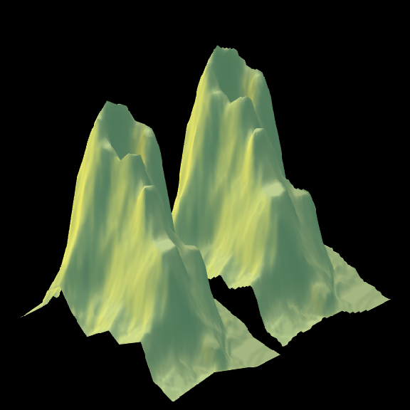
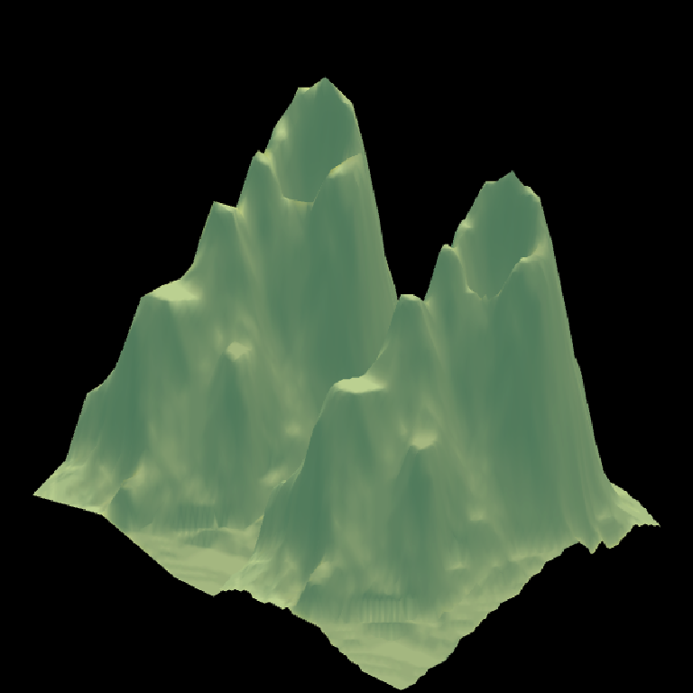
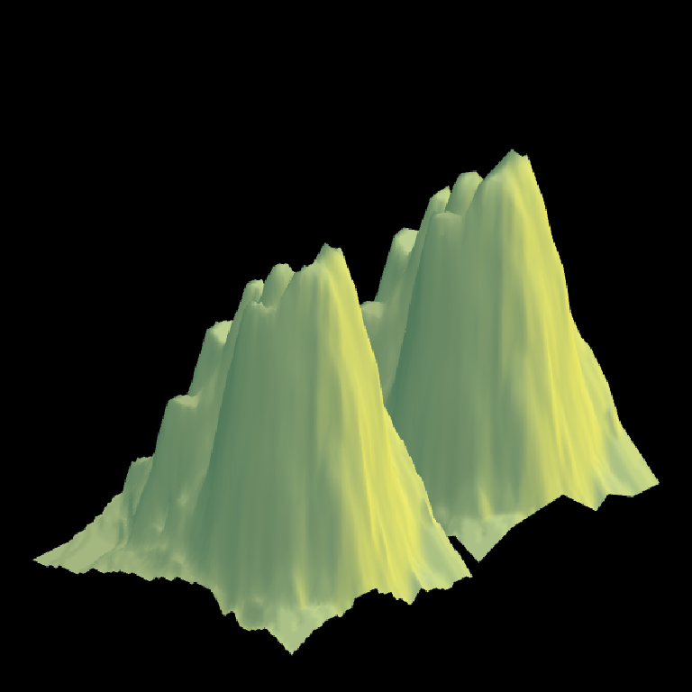
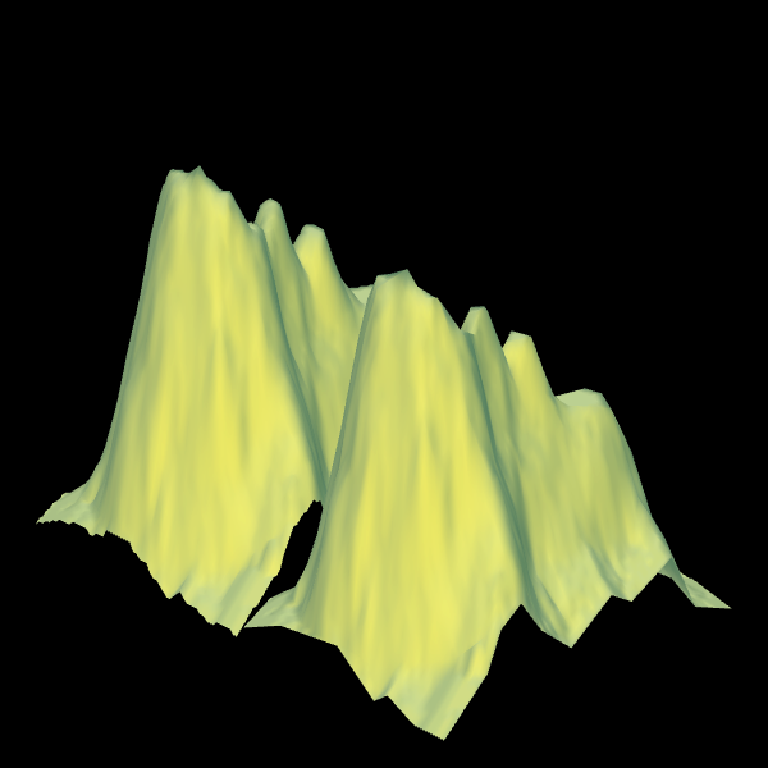

<!-- README.md is generated from README.Rmd. Please edit that file -->

# terrainmeshr

<!-- badges: start -->

[](https://CRAN.R-project.org/package=terrainmeshr)
<!-- badges: end -->

*terrainmesher* is an R package to simplify dense height fields/terrain
maps by constrained Delunay Triangulation, using methods the methods
described by [Fast Polygonal Approximation of Terrains and Height Fields
(PDF)](https://www.mgarland.org/files/papers/scape.pdf) Michael Garland
and Paul S. Heckbert (1995) and based on code from the [hmm
library](https://github.com/fogleman/hmm) written by [Michael
Fogleman](https://www.michaelfogleman.com/projects/hmm/).

## Installation

You can install the released version of terrainmeshr from
[CRAN](https://CRAN.R-project.org) with:

``` r
install.packages("terrainmeshr")
```

And the development version from [GitHub](https://github.com/) with:

``` r
# install.packages("devtools")
devtools::install_github("tylermorganwall/terrainmeshr")
```

## Example

The built-in `volcano` dataset in R is a 87x61 matrix of elevation
values. To perform a full triangulation of the height map, we require
`86 * 60 * 2 = 10320` triangles (two triangles for each box of
coordinates). Let’s plot what that looks like:

``` r

#Generate full triangulation of `volcano`
tri_volcano = matrix(0, nrow = 86*60*3*2, ncol = 3)
counter = 1
for(i in 1:(nrow(volcano) - 1)) {
  for(j in 1:(ncol(volcano) - 1)) {
    tri_volcano[6*(counter-1)+1, ] = c(i, volcano[i,j], j)
    tri_volcano[6*(counter-1)+2, ] = c(i, volcano[i,j+1], j+1)
    tri_volcano[6*(counter-1)+3, ] = c(i+1, volcano[i+1,j], j)
    tri_volcano[6*(counter-1)+4, ] = c(i+1, volcano[i+1,j+1], j+1)
    tri_volcano[6*(counter-1)+5, ] = c(i+1, volcano[i+1,j], j)
    tri_volcano[6*(counter-1)+6, ] = c(i, volcano[i,j+1], j+1)
    counter = counter + 1
  }
}

#Function to plot triangles on top of image
plot_polys = function(tri_matrix) {
  tri_matrix[,3] = max(tri_matrix[,3])-tri_matrix[,3]+1
  for(i in seq_len(nrow(tri_matrix)/3)) {
    polypath(tri_matrix[(3*(i-1)+1):(3*i), c(1,3)])
  }
}

image(x=1:nrow(volcano), y = 1:ncol(volcano), volcano)
plot_polys(tri_volcano)
```

<!-- -->

Fully triangulating a height field always requires `(M-1) * (N-1) * 2`
triangles, but some models have large smooth regions where this level of
detail is unnecessary. Detailed meshes are memory hungry, output to
large models when saved to disk, and can be difficult for slower systems
to handle when plotted in 3D. We can use `terrrainmeshr` to perform a
triangulation of the height field that maintains a user-specified amount
of total error in the model, or uses a set number of triangles.

First, let’s try triangulating the matrix without any loss of precision
(by setting `maxError = 0`).

``` r

library(terrainmeshr)

tris = triangulate_matrix(volcano, maxError = 0, verbose = TRUE)
#> 35.3% reduction: Number of triangles reduced from 10614 to 6867. Error: 0.000000
image(x=1:nrow(volcano), y = 1:ncol(volcano), volcano)
plot_polys(tris)
```

<!-- -->

Here, triangulating the matrix resulted in a 35% reduction in the number
of triangles required, with no additional error. Let’s try setting a
maximum number of triangles to use, or set the maximum allowable error
value to a small finite number:

``` r

tris1 = triangulate_matrix(volcano, maxTriangles = 200, verbose = TRUE)
#> 98.1% reduction: Number of triangles reduced from 10614 to 200. Error: 5.799988
image(x=1:nrow(volcano), y = 1:ncol(volcano), volcano)
plot_polys(tris1)
```

<!-- -->

``` r

tris2 = triangulate_matrix(volcano, maxError = 2, verbose = TRUE)
#> 91.7% reduction: Number of triangles reduced from 10614 to 878. Error: 2.000000
image(x=1:nrow(volcano), y = 1:ncol(volcano), volcano)
plot_polys(tris2)
```

<!-- -->

By setting the allowable maximum error to 2, we have reduced the size of
the model to over 1/10th it’s original size. We also computed a
minimum-error model with a set number of triangles. Let’s inspect the
max error model in 3D and compare it (green) to the full triangulated
version (red). We’ll load the rayshader and rgl packages to help with
plotting the models in 3D.

``` r

library(rayshader)
library(rgl)

tri_volcano[,3] = -tri_volcano[,3] 

par3d(windowRect=c(0,0,600,600))
rgl::rgl.triangles(tris2, color="green", lit=TRUE)
#> Warning in rgl::rgl.triangles(tris2, color = "green", lit = TRUE): 'rgl::rgl.triangles' is deprecated.
#> Use 'triangles3d' instead.
#> See help("Deprecated")
rgl::rgl.triangles(tri_volcano, color="red", lit=TRUE)
#> Warning in rgl::rgl.triangles(tri_volcano, color = "red", lit = TRUE): 'rgl::rgl.triangles' is deprecated.
#> Use 'triangles3d' instead.
#> See help("Deprecated")
bg3d(color="black")

par(mfrow=c(2,2))
render_camera(phi=30,fov=0,theta=45,zoom=0.9)
render_snapshot()
```

<!-- -->

``` r
render_camera(phi=30,fov=0,theta=135,zoom=0.9)
render_snapshot()
```

<!-- -->

``` r
render_camera(phi=30,fov=0,theta=225,zoom=0.9)
render_snapshot()
```

<!-- -->

``` r
render_camera(phi=30,fov=0,theta=315,zoom=0.9)
render_snapshot()
```

<!-- -->

``` r
par(mfrow=c(1,1))

rgl.close()
#> Warning in rgl.close(): 'rgl.close' is deprecated.
#> Use 'close3d' instead.
#> See help("Deprecated")
```

With minimal loss of detail, we have computed a 3D model that is a good
approximation to the original surface, with far fewers polygons used.

Now, let’s add a texture and compute the lighting ourselves with the
rayshader package using the hi-res mesh, and apply that texture to the
low-res approximation. Using the texture and lighting computed from the
full resolution mesh with the low-resolution mesh can give the
appearance of small details without the computational expense of
displaying the full mesh.

``` r

temp_texture = tempfile(fileext = ".png")

#Compute the texture using the full-resolution mesh and save it to file
volcano %>%
  sphere_shade() %>%
  add_shadow(ray_shade(volcano)) %>% 
  save_png(temp_texture)

#Compute the texcoords for the 3D mesh
texcoords = tris2[,c(1,3)]
texcoords[,1] = texcoords[,1]/max(texcoords[,1])
texcoords[,2] = texcoords[,2]/max(texcoords[,2])

texcoords2 = tri_volcano[,c(1,3)]
texcoords2[,2] = -texcoords2[,2]
texcoords2[,1] = texcoords2[,1]/max(texcoords2[,1])
texcoords2[,2] = 1-texcoords2[,2]/max(texcoords2[,2])

#Plot the two volcanos, side by side
par3d(windowRect=c(0,0,600,600))

rgl::rgl.triangles(tris2, lit=FALSE, texture = temp_texture, texcoords = texcoords)
#> Warning in rgl::rgl.triangles(tris2, lit = FALSE, texture = temp_texture, : 'rgl::rgl.triangles' is deprecated.
#> Use 'triangles3d' instead.
#> See help("Deprecated")
rgl::rgl.triangles(tri_volcano,  lit=FALSE, texture = temp_texture, texcoords = texcoords2)
#> Warning in rgl::rgl.triangles(tri_volcano, lit = FALSE, texture = temp_texture, : 'rgl::rgl.triangles' is deprecated.
#> Use 'triangles3d' instead.
#> See help("Deprecated")
bg3d(color="black")

par(mfrow=c(2,2))
render_camera(phi=30,fov=0,theta=45,zoom=0.9)
render_snapshot()
```

<!-- -->

``` r
render_camera(phi=30,fov=0,theta=135,zoom=0.9)
render_snapshot()
```

<!-- -->

``` r
render_camera(phi=30,fov=0,theta=225,zoom=0.9)
render_snapshot()
```

<!-- -->

``` r
render_camera(phi=30,fov=0,theta=315,zoom=0.9)
render_snapshot()
```

<!-- -->

We see that there is only a small perceivable difference between the two
models, despite one of them being 1/10th the size of the other.
